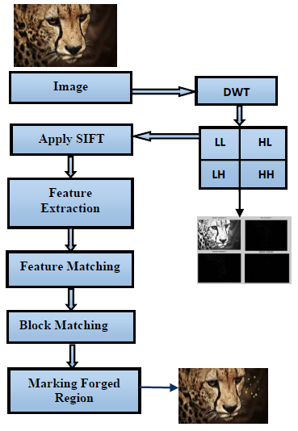

# Image-Forgery-Detection
This project is an attempt to detect forged images using DWT and SIFT feature detection algorithms.

Block diagram of the system is as follows.

## Decomposing Using DWT  

Initially, 2D-DWT is applied in the initial stage of forgery detection process as it helps to extract more number of SIFT features which will help in better detection performance. DWT is applied on the image for copy-move forgery detection, the image is decomposed into four different sub-bands LL, LH, HL, and HH. Most of the data is concentrated in LL sub-band and it is considered as the approximation of the image. It represents the coarse level coefficients of the original image. 
It is the LL sub-band which is decomposed into four sub-band at the next level. Size of the image is reduced at every level by the DWT transform. Fig. 4 shows the decomposing of Butterfly image after applying DWT on it, the image is divided in 4 parts in first level and in next level its LL sub-band is further decomposed.

## SIFT Feature Extraction

SIFT descriptors that are invariant to scaling, rotation and affine transformations are computed using the following three major steps.
* Scale Space Extrema Detection  
  A function, L(x, y, σ) is defined as the scale-space of an image which is generated by the convolution of Gaussian function, G(x, y,     σ), and an input image, I(x,y):
  
    
  
 
* Keypoint Localization  
  Selection of keypoints from extrema is done by rejecting the points along image edges or those with low contrast as they are unstable   over image variations. The Taylor expansion of scale- space function D (x, y, σ), shifted such that the sample point is origin:
  
  

* Keypoint Descriptor Generation 
The values of orientation histogram, in both image plane and scale space form the descriptor. With 4X4 array of histograms and 8 orientation bins in each, results in 4X4X8=128 element feature vector.

## Clustering
Extracted SIFT key point descriptors from the approximate sub image of the DWT decomposed original image are grouped using agglomerative hierarchical clustering. The clustering is completed by using one of the many linkage methods such as median, centroid or ward.

## Key point Matching
Key point matching is another important stage of the proposed method, which mainly concern with the matching of extracted feature keypoints from SIFT algorithm. In key point matching first reads the keypoint from given input image then, Compare the keypoints of images and if the keypoints matches then draw a line which indicating the matched keypoints, then append the two images and draw a line which indicate the matches.

# Results
In the image below, the first part shows which are the forged regions and the part besides is the original image.

 
 
 The image below is the orignal image.
 
 
 
 
 
 The image below is forged. We can see the difference easily. The forged image has one flower extra, which has been copy-pasted.
 
 
 
 
 Below is the result image. The image has been resized by the system. As we can see the forged region is completed marked dark.
 
 
 
 
 

